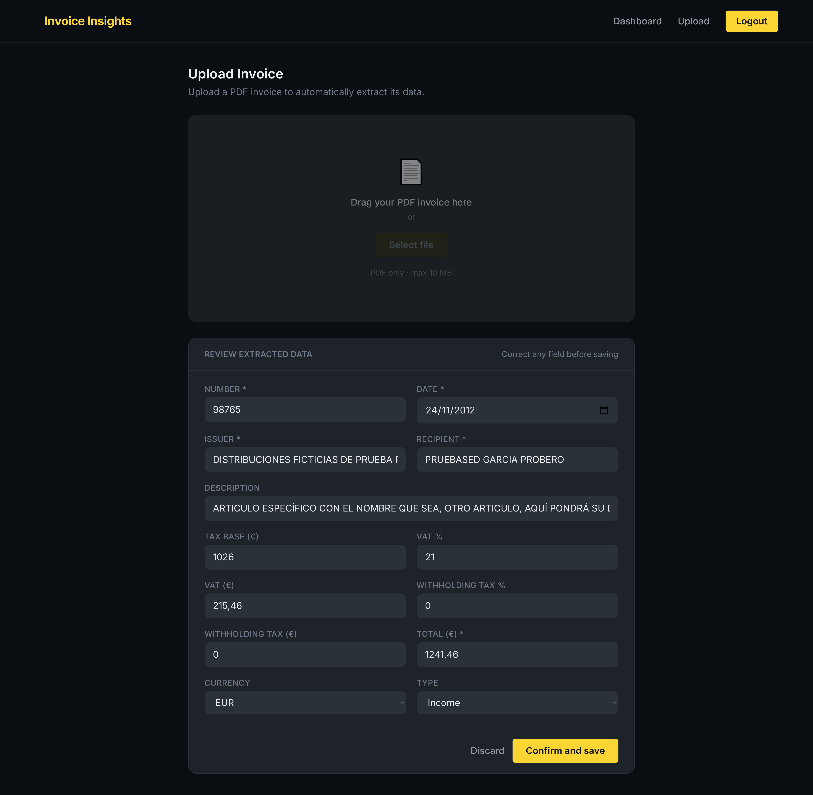
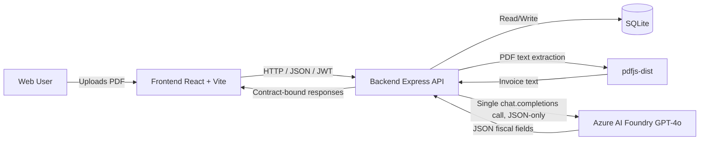

# Invoice Insights

> 🌐 [Versión en español](./README.es.md)

A **full-stack SaaS** for Spanish freelancers and SMEs that **extracts fiscal data from invoice PDFs** using **generative AI** (Azure AI Foundry with GPT-4o) and surfaces a **financial dashboard** with KPIs, monthly trends, top clients/suppliers, and quarterly VAT reporting.

Built in one week as a two-person team project.

## Screenshots

### Dashboard


*KPIs, monthly trends, top clients/suppliers, and quarterly VAT — [view full dashboard](./docs/screenshots/dashboard-full.png)*

### Invoice upload



*Upload a PDF invoice; the AI extracts structured fiscal data into the dashboard.*

## What problem it solves

Managing invoices and preparing fiscal metrics is typically slow and error-prone — copy/import work, reconciling VAT/IRPF, analyzing income vs. expenses. Invoice Insights automates the **structured capture** from PDFs and turns that data into **actionable indicators**.

## Value proposition (SaaS focus)

- **Time savings** — much less manual work when registering invoices.
- **Financial control** — KPIs and trends (income, expenses, profit, average ticket size, etc.).
- **Fiscal visibility** — VAT and IRPF calculated from the extracted fields.
- **Product experience** — clear user flow (register → upload → review/confirm → dashboard).

## Tech stack

- **Backend**: Node.js (>= 20), Express, SQLite (`better-sqlite3`), JWT (`jsonwebtoken`), password hashing (`bcrypt`), file uploads (`multer`), PDF parsing (`pdfjs-dist`).
- **Frontend**: React + TypeScript (Vite), Tailwind CSS, React Router, Chart.js (`react-chartjs-2`).
- **Generative AI**: Azure AI Foundry (GPT-4o) for **structured JSON extraction** (not chatbot).

## Architecture



- **API contract** — the boundary between frontend and backend lives in [`docs/api-contract.md`](./docs/api-contract.md) (endpoint shapes + conventions).
- **Frontend mock mode** — the frontend can read data from `frontend/public/mock/data.json` (useful for developing without the backend), configured in `frontend/src/services/api.ts`.
- **Privacy / GDPR** — the uploaded PDF is used only for extraction and is deleted from disk during the upload flow (project invariant; see contract).

## AI integration — generative AI with real value, no agents

We deliberately chose a **single-call extraction pipeline** over a multi-agent architecture. For structured invoice data, one well-prompted call returning validated JSON is more reliable, cheaper, easier to debug, and faster than orchestrating multiple agents — and avoids the failure modes that multi-agent systems introduce when a single deterministic answer is what you actually need.

The pipeline:

1. The user uploads an invoice in PDF format.
2. The backend extracts the **text** from the PDF (including multi-page PDFs) using `pdfjs-dist`.
3. A **single call** is made to Azure AI Foundry (GPT-4o) requesting **only a JSON** with fiscal fields (e.g., `numero`, `fecha`, `base_imponible`, `iva_cantidad`, `irpf_cantidad`, `total`, `tipo`, etc.).
4. The backend validates the JSON (date format, ISO currency, totals consistency, etc.) and persists the data in SQLite.
5. The frontend consumes the analytics endpoints and renders the dashboard.

## Key features

- **Authentication** — registration/login and session via JWT.
- **PDF invoice upload** — type/size validation, extraction, and persistence.
- **Review/confirmation (drafts)** — the contract includes a draft flow (`facturas_draft`) before confirming the final invoice.
- **Dashboard** — KPIs, monthly evolution, top clients/suppliers, quarterly VAT.
- **Management** — listing and deletion of user invoices.

## Local deployment

### Prerequisites

- Node.js **>= 20**
- (Recommended) Git and a terminal (PowerShell, bash, etc.)

### 1) Backend (API)

```bash
cd backend
cp .env.example .env
npm install
npm run init-db
npm run dev
```

- **API**: `http://localhost:3000`
- Configure in your `.env` (see template in [`backend/.env.example`](./backend/.env.example)):
  - `JWT_SECRET` (required)
  - `AZURE_AI_ENDPOINT`, `AZURE_AI_API_KEY`, `AZURE_AI_DEPLOYMENT` (required for AI extraction)
  - `CORS_ORIGIN` (for development: `http://localhost:5173`)

Generate a strong `JWT_SECRET`:

```bash
node -e "console.log(require('crypto').randomBytes(48).toString('hex'))"
```

### 2) Frontend (UI)

```bash
cd frontend
npm install
npm run dev
```

- **Web**: `http://localhost:5173`
- The frontend calls the API at `http://localhost:3000/api` by default (see `frontend/src/services/api.ts`).
- If you want to use mock data (no backend), toggle the `USE_MOCK` constant in `frontend/src/services/api.ts` (serves `/mock/data.json` from `frontend/public/`).

### 3) Useful URLs

- Health check: `GET http://localhost:3000/api/health`
- Authentication: `POST http://localhost:3000/api/auth/register`, `POST http://localhost:3000/api/auth/login`
- PDF upload: `POST http://localhost:3000/api/facturas/upload`

## Repository structure

```
ai-invoice-analyzer/
├── docs/        # API contract (boundary) and documentation
├── backend/     # Express + SQLite + AI extraction
└── frontend/    # React + Vite + Tailwind (dashboard)
```

## Note on language and fiscal fields

The **API contract field names are in Spanish** for fiscal vocabulary reasons (`numero`, `fecha`, `base_imponible`, `iva_*`, `irpf_*`, `tipo`, etc.) and **should not be translated** — they are aligned with Spanish tax forms and terminology. Translating them would break the mapping to official documents.

## Authors

- Jaime Novillo Benito
- Jorge Pulgar Pacho
