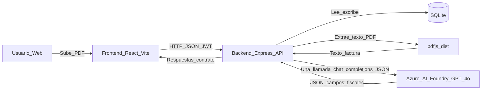

# Invoice Insights

Aplicación **SaaS full‑stack** para autónomos y pymes en España que **extrae datos fiscales desde facturas PDF** usando **IA generativa** (Azure AI Foundry con GPT‑4o) y muestra un **dashboard financiero** con KPIs, evolución mensual, top clientes/proveedores e IVA trimestral.

## ¿Qué problema resuelve?

Gestionar facturas y preparar métricas fiscales suele ser lento y propenso a errores (copiar/importar datos, cuadrar IVA/IRPF, analizar ingresos vs. gastos). Invoice Insights automatiza la **captura estructurada** desde PDFs y convierte esos datos en **indicadores accionables**.

## Propuesta de valor (enfoque SaaS)

- **Ahorro de tiempo**: menos trabajo manual al registrar facturas.
- **Control financiero**: KPIs y tendencias (ingresos, gastos, beneficio, ticket medio, etc.).
- **Visibilidad fiscal**: IVA e IRPF calculados a partir de los campos extraídos.
- **Experiencia producto**: flujo de usuario claro (registro → subida → revisión/confirmación → dashboard).

## Tecnologías utilizadas (stack)

- **Backend**: Node.js (>= 20), Express, SQLite (`better-sqlite3`), JWT (`jsonwebtoken`), hash de contraseñas (`bcrypt`), subida de ficheros (`multer`), parsing de PDFs (`pdfjs-dist`).
- **Frontend**: React + TypeScript (Vite), Tailwind CSS, React Router, Chart.js (`react-chartjs-2`).
- **IA generativa**: Azure AI Foundry (GPT‑4o) para **extracción estructurada en JSON** (no chatbot).

## Arquitectura técnica



- **Contrato API**: el “acoplamiento” entre frontend y backend vive en [`docs/api-contract.md`](docs/api-contract.md) (shape de endpoints + convenciones).
- **Modo mock en frontend**: el frontend puede leer datos de `frontend/public/mock/data.json` (útil para desarrollar sin backend), configurado en `frontend/src/services/api.ts`.
- **Privacidad / GDPR**: el PDF subido se usa solo para extracción y se elimina del disco en el flujo de upload (invariante del proyecto; ver contrato).

## Integración de IA (IA generativa con valor real, sin agentes)

Este proyecto incorpora IA generativa como **pipeline de extracción**:

1. El usuario sube una factura en PDF.
2. El backend extrae el **texto** del PDF (incluyendo PDFs multi‑página) usando `pdfjs-dist`.
3. Se hace **una única invocación** a Azure AI Foundry (GPT‑4o) solicitando **solo un JSON** con campos fiscales (por ejemplo `numero`, `fecha`, `base_imponible`, `iva_cantidad`, `irpf_cantidad`, `total`, `tipo`, etc.).
4. El backend valida el JSON (formato de fecha, moneda ISO, coherencia de totales, etc.) y persiste los datos en SQLite.
5. El frontend consume los endpoints de analítica y renderiza el dashboard.

**Restricción del profesor (cumplida):** no se usan **sistemas multi‑agente** ni “agentes” de IA. La aplicación se basa en procesos de IA generativa (extracción estructurada) y lógica determinista en backend.

## Funcionalidades principales

- **Autenticación**: registro/login y sesión mediante JWT.
- **Subida de facturas PDF**: validación de tipo/tamaño, extracción y persistencia.
- **Revisión/confirmación (drafts)**: el contrato contempla un flujo de borrador (`facturas_draft`) antes de confirmar la factura final.
- **Dashboard**: KPIs, evolución mensual, top clientes/proveedores, IVA trimestral.
- **Gestión**: listado y eliminación de facturas del usuario.

## Tutorial de despliegue local

### Requisitos previos

- Node.js **>= 20**
- (Recomendado) Git y un terminal (PowerShell, bash, etc.)

### 1) Backend (API)

```bash
cd backend
cp .env.example .env
npm install
npm run init-db
npm run dev
```

- **API**: `http://localhost:3000`
- Configura en tu `.env` (ver plantilla en [`backend/.env.example`](backend/.env.example)):
  - `JWT_SECRET` (obligatorio)
  - `AZURE_AI_ENDPOINT`, `AZURE_AI_API_KEY`, `AZURE_AI_DEPLOYMENT` (obligatorio para la extracción con IA)
  - `CORS_ORIGIN` (para desarrollo: `http://localhost:5173`)

Generar un `JWT_SECRET` fuerte:

```bash
node -e "console.log(require('crypto').randomBytes(48).toString('hex'))"
```

### 2) Frontend (UI)

```bash
cd frontend
npm install
npm run dev
```

- **Web**: `http://localhost:5173`
- El frontend llama por defecto a la API en `http://localhost:3000/api` (ver `frontend/src/services/api.ts`).
- Si quieres usar datos mock (sin backend), ajusta la constante `USE_MOCK` en `frontend/src/services/api.ts` (sirve `/mock/data.json` desde `frontend/public/`).

### 3) URLs útiles

- Health check: `GET http://localhost:3000/api/health`
- Autenticación: `POST http://localhost:3000/api/auth/register`, `POST http://localhost:3000/api/auth/login`
- Subida de PDF: `POST http://localhost:3000/api/facturas/upload`

## Estructura del repositorio

```
ai-invoice-analyzer/
├── docs/                     # contrato API (boundary) y documentación
├── backend/                   # Express + SQLite + extracción IA
└── frontend/                  # React + Vite + Tailwind (dashboard)
```

## Autores

- Jaime Novillo Benito
- Jorge Pulgar Pacho

## Nota sobre el idioma y los campos fiscales

- Los **nombres de campos del contrato** están en español por vocabulario fiscal (`numero`, `fecha`, `base_imponible`, `iva_*`, `irpf_*`, `tipo`, etc.) y **no deben traducirse** (están alineados con formularios/terminología en España).
